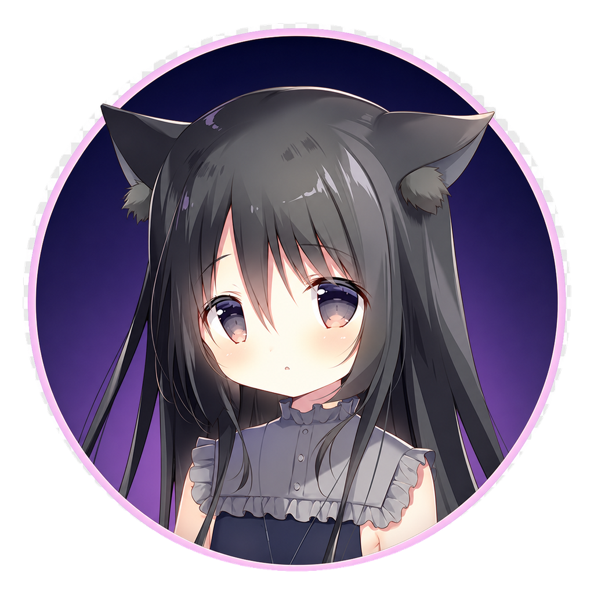

# Moepet

<p align="center">
  
</p>

<p align="center">
  一个面向 Windows 的 Live2D AI 桌面伴侣。<br>
  透明桌宠、自然对话、语音交互、屏幕感知与角色独立记忆，全部集中在本地桌面应用中。
</p>

## 项目亮点

- **Live2D 默认启动**：支持呼吸、眨眼、视线跟随、语义表情、文字口型与音频口型。
- **透明区域鼠标穿透**：Windows 下通过 `WM_NCHITTEST` 按渲染 Alpha 判断；人物区域可交互，透明区域不遮挡桌面。
- **AI 角色对话**：兼容 OpenAI Chat Completions API，可连接 DeepSeek、OpenAI、Ollama 等服务。
- **角色独立记忆**：原始消息、近期摘要、长期事实、情绪记录与日历归档均按角色隔离。
- **时间线与日记**：自动生成日记、周记、月记、季记和年记，并显示聊天与陪伴频率。
- **语音输入输出**：支持 faster-whisper、OpenAI 兼容 ASR、GPT-SoVITS 与可选音频播放。
- **屏幕理解**：支持手动截图识别，以及明确授权后的随机主动观察。
- **星空设置中心**：支持最大化、还原、最小化和正常窗口层级，不会强制占据前台。

## 运行环境

- Windows 10/11
- Python 3.10 或更高版本
- 支持 OpenGL 的显卡驱动
- 一个 OpenAI Chat Completions 兼容模型服务

## 快速开始

```powershell
git clone https://github.com/zhuge-Tom/moepet.git
cd moepet

python -m venv .venv
.\.venv\Scripts\python.exe -m pip install --upgrade pip
.\.venv\Scripts\python.exe -m pip install PySide6 keyring jieba live2d-py==0.7.0.4
.\.venv\Scripts\python.exe main.py
```

程序启动后：

1. 从托盘菜单打开“设置”。
2. 在“AI 模型”中选择服务预设。
3. 填写 Base URL、API Key 和模型名称。
4. 点击“测试连接”，成功后应用设置。
5. 双击 Noir 打开或关闭对话框。

API Key 优先写入 Windows 凭据管理器，不会明文提交到仓库。`config.json` 和角色运行数据已通过 `.gitignore` 排除。

## 模型服务示例

| 服务 | Base URL | 模型示例 |
| --- | --- | --- |
| DeepSeek | `https://api.deepseek.com/v1` | `deepseek-chat` |
| OpenAI | `https://api.openai.com/v1` | `gpt-4o-mini` |
| Ollama | `http://localhost:11434/v1` | `qwen3:8b` |

地址不包含 `/chat/completions` 时，Moepet 会自动补全标准接口路径。

## 桌宠交互

- **拖动人物**：移动桌宠位置。
- **双击人物**：打开或关闭对话框。
- **单击头部**：触发摸头反应。
- **右键人物**：打开快捷菜单。
- **透明区域**：鼠标事件直接穿透到底层窗口。
- **设置窗口**：支持最小化、最大化以及恢复到最大化前的尺寸。

位置、缩放、透明度、渲染器和对话框尺寸会保存到本地配置，重新启动后恢复。

## 角色记忆

每个角色拥有独立的 SQLite WAL 数据库：

```text
characters/<角色>/memory/
├─ memory.db
├─ summaries/          # 近期摘要 Markdown 正本
└─ archives/
   ├─ diary/           # 日记
   ├─ weekly/          # 周记
   ├─ monthly/         # 月记
   ├─ quarterly/       # 季记
   └─ yearly/          # 年记
```

记忆流程：

1. 最近若干轮原始对话保留在即时上下文中。
2. 超出窗口的对话由当前聊天模型整理为连续摘要。
3. 较旧摘要进一步提炼为长期事实。
4. 检索综合关键词、稀疏向量、时间、主体、分类、重要度和新近度。
5. 来源链会排除已被上层记忆覆盖的内容，避免重复注入。

Markdown 是人工可读正本，SQLite 用于索引、来源关系和检索。记忆处理在回复显示后异步执行；分析失败不会阻塞普通聊天。

### 可选 Rust 检索核心

项目包含 PyO3/Rust 混合检索加速模块。未构建时会自动回退到 Python 实现。

```powershell
.\.venv\Scripts\python.exe -m pip install "maturin>=1.7,<2"
cd native\memory_core
..\..\.venv\Scripts\python.exe -m maturin develop --release
```

## 语音与屏幕能力

安装可选集成：

```powershell
.\.venv\Scripts\python.exe -m pip install -r requirements-optional.txt
```

主要组件：

- `faster-whisper`、`sounddevice`：本地语音识别与录音。
- `PySide6-Addons`：生成语音的 WAV 播放。
- `rapidocr-onnxruntime`：本地 OCR 回退。
- `keyboard`：全局语音和截图快捷键。
- `jieba`：中文记忆分词；缺失时自动使用字符级特征。

云端屏幕理解必须在设置中明确授权。截图默认在处理完成后删除；随机观察默认关闭。

## 添加角色

角色目录的最小结构：

```text
characters/my_character/
├─ config.json
├─ animations.json
└─ sprites/
   ├─ idle.png
   └─ live2d/
      └─ model/model.model3.json
```

静态立绘可在 `config.json` 中配置情绪、眨眼和摸头图片：

```json
{
  "name": "My Character",
  "scale": 0.6,
  "sprites": {
    "idle": "idle.png",
    "happy": "happy.png",
    "sad": "sad.png"
  },
  "blinks": {
    "idle": "idle_closed.png"
  },
  "interactions": {
    "head_touch": ["bashful.png"]
  }
}
```

角色资料库支持导入 TXT、Markdown 和 JSON，并区分世界观、角色设定与对话示例。

## 项目结构

```text
moepet/
├─ assets/                 # 程序 PNG/ICO 图标
├─ characters/             # 角色配置、立绘、Live2D 与本地运行数据
├─ core/
│  └─ memory/              # SQLite、检索、压缩与情绪分析
├─ native/memory_core/     # 可选 Rust/PyO3 加速
├─ tests/                  # 单元、UI 与回归测试
├─ ui/                     # 桌宠、Live2D、对话框、设置和托盘
├─ requirements-optional.txt
└─ main.py
```

## 测试

```powershell
$env:QT_QPA_PLATFORM = "offscreen"
.\.venv\Scripts\python.exe -m pytest -q
```

Rust 模块：

```powershell
C:\Users\<用户名>\.cargo\bin\cargo.exe test --release --manifest-path native\memory_core\Cargo.toml
C:\Users\<用户名>\.cargo\bin\cargo.exe clippy --release --manifest-path native\memory_core\Cargo.toml -- -D warnings
```

## 隐私与素材

- 记忆、聊天历史、角色资料和截图默认保存在本机。
- 只有实际发送给已配置模型的有限上下文会离开本机。
- 请勿提交 API Key、参考音频、训练权重或个人聊天数据。
- 请确保角色图片、Live2D、音频和模型权重拥有合法使用许可。

感谢 B 站用户“硕枫”分享 Noir 的 Live2D 模型资源。

## 许可说明

仓库当前未附带统一的软件许可证；使用、修改或再分发前请先取得项目作者许可。第三方角色素材、模型和音频沿用各自许可，不因代码公开而自动授权。
