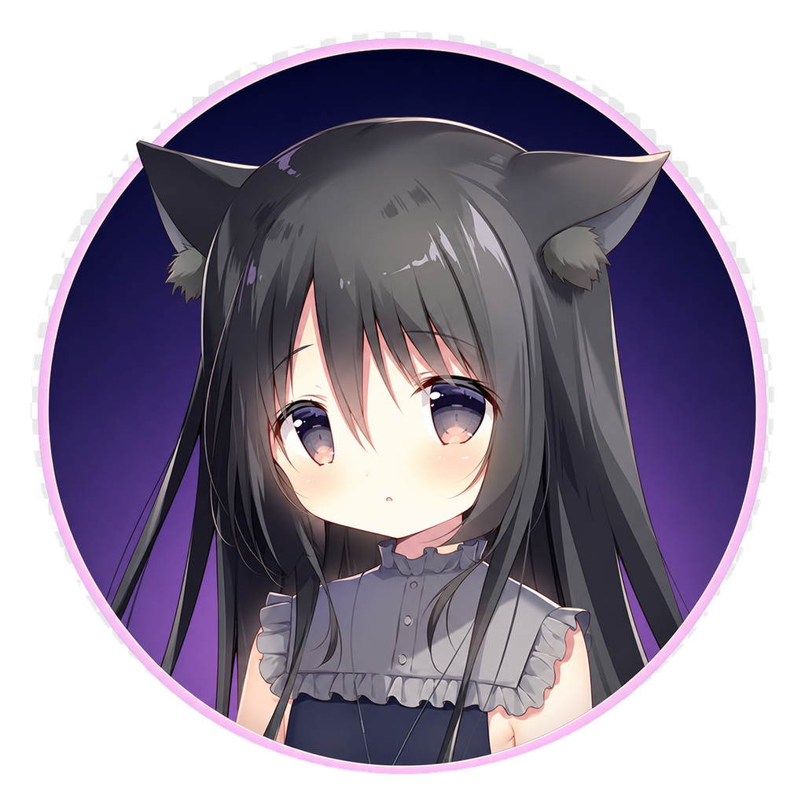

# Moepet

<p align="center">
  
</p>

<p align="center">
  面向 Windows 的 Live2D AI 桌面伴侣：透明桌宠、模型对话、本地语音、屏幕感知和角色独立记忆。
</p>

## 功能

- 默认使用 Live2D，支持呼吸、眨眼、视线跟随、表情和口型。
- Windows 透明区域鼠标穿透，只有人物实体区域接收点击。
- 兼容 OpenAI Chat Completions API，可使用 DeepSeek、OpenAI、Ollama 等服务。
- 默认使用本地 Style-Bert-VITS2 ONNX 日语语音（CPU 即可运行，无需 API Key），
  流式自适应分段让回复在一秒左右开口；也支持 GPT-SoVITS 与 OpenAI 兼容 TTS。
- 随机识图主动搭话：角色会不定期理解你屏幕上正在做的事，
  像旅伴一样主动开启一段可以顺着聊下去的对话（可关闭）。
- 语音输入与图像理解内置免费云端预设（SiliconFlow SenseVoiceSmall、
  智谱 GLM-4V-Flash），粘贴 API Key 即可使用；也支持本地 faster-whisper 与 OCR。
- 每个角色拥有独立的聊天历史、记忆库、资料库、声音和显示配置。
- 支持近期摘要、长期记忆、时间线以及日/周/月/季/年归档。
- 对话框逐字显示与“正在思考…”占位，节奏与语音朗读贴合。

## 运行要求

- Windows 10 或 Windows 11（64 位）
- Git
- Python 3.11，可通过 `py -3.11` 调用
- 支持 OpenGL 的显卡驱动
- 首次安装需要联网
- 至少预留约 4 GB 磁盘空间

本地 TTS 默认选择 Style-Bert-VITS2 ONNX。普通克隆不包含语音运行时与模型；需要本地声音时，按设置页引导下载到 `vendor/style_bert_vits2`。GPT-SoVITS CPU 兼容包仍可作为备选；有 NVIDIA GPU 时，也可以改用自行解压的 GPU 整合包。

## 安装

### 方式一：免安装 EXE（推荐，无需 Python）

1. 到 [Releases](https://github.com/zhuge-Tom/moepet/releases) 下载
   `Moepet-windows-x64.zip`，解压到任意目录。
2. 需要本地语音时，再下载 `moepet-sbv2-noir-v1.zip`（约 1 GB，
   自带便携 Python 运行时与全部模型），**解压到同一个目录**
   （解压后应出现 `vendor\style_bert_vits2\` 子目录）。
3. 双击 `Moepet.exe` 启动。

### 方式二：源码运行

在 PowerShell 中运行：

```powershell
git clone https://github.com/zhuge-Tom/moepet.git
cd moepet
powershell -ExecutionPolicy Bypass -File .\setup.ps1
.\.venv\Scripts\python.exe main.py
```

也可以直接双击 `启动桌宠.bat`。它会在首次运行时检测主环境，缺失时调用 `setup.ps1`，随后启动桌宠。

`setup.ps1` 默认只创建主程序的 `.venv` 并安装运行依赖，不下载任何模型，
克隆保持轻量、也没有 Git LFS 配额问题。语音资产按需一键安装：

```powershell
# 默认语音：Style-Bert-VITS2 本地日语（约 1 GB，含便携运行时，推荐）
powershell -ExecutionPolicy Bypass -File .\setup.ps1 -InstallSbv2

# 备选语音：GPT-SoVITS CPU 兼容包
powershell -ExecutionPolicy Bypass -File .\setup.ps1 -InstallCpuTts
```

安装器会从 Release 下载、SHA-256 校验并解压到 `vendor/` 对应目录；
SBV2 包解压即用，无需再配置 Python 环境。GPU 整合包由用户自行选择
下载位置，Moepet 不会占用或复制它。

再次启动只需：

```powershell
cd moepet
.\.venv\Scripts\python.exe main.py
```

## 首次配置

启动后右键桌宠，或者从系统托盘菜单打开“设置”。建议依次配置：

1. **AI 模型**：配置聊天服务。
2. **语音合成**：选择本地 Noir 语音或远程 TTS。
3. **语音输入**：需要麦克风对话时再启用。
4. **图像理解**：需要模型理解截图时再配置。
5. **通用设置 / 角色设置**：调整角色、显示、位置和交互。

点击“应用”会立即生效；点击“确定”会保存并关闭窗口。

## 配置 AI 对话

打开“设置 → AI 模型”，填写以下三项：

- **Base URL**：服务根地址，通常以 `/v1` 结尾。
- **API Key**：远程服务的密钥；本地 Ollama 等服务可以留空。
- **模型**：服务端实际提供的模型 ID。

常见示例：

| 服务 | Base URL | 模型示例 | API Key |
| --- | --- | --- | --- |
| DeepSeek | `https://api.deepseek.com/v1` | `deepseek-chat` | 必填 |
| OpenAI | `https://api.openai.com/v1` | `gpt-4o-mini` | 必填 |
| Ollama | `http://localhost:11434/v1` | `qwen3:8b` | 通常留空 |
| 其他兼容服务 | 服务商给出的 `/v1` 地址 | 服务商模型 ID | 按服务商要求 |

Base URL 不需要填写 `/chat/completions`，Moepet 会自动补全接口路径。填写完成后先点击“测试连接”，成功后再应用。

API Key 会优先保存到 Windows 凭据管理器，不应写入仓库、截图或角色文件。若修改 `config.json`，请保持 `api_key` 为空并从设置页面输入密钥。

## 配置语音合成

### 本地 Style-Bert-VITS2 ONNX（默认）

新配置默认选择本地 Style-Bert-VITS2 ONNX。模型与运行时体积较大，
不随仓库分发，推荐从 Release 一键安装：

```powershell
powershell -ExecutionPolicy Bypass -File .\setup.ps1 -InstallSbv2
```

或手动从 [Releases](https://github.com/zhuge-Tom/moepet/releases) 下载
`moepet-sbv2-noir-v1.zip` 解压到项目根目录。资产包内含：

- [Style-Bert-VITS2 上游推理源码](https://github.com/litagin02/Style-Bert-VITS2)（LGPL，随包附许可证）
- `runtime/`：便携 Python 3.11 运行时，推理依赖已预装，解压即用
- `bert/deberta-v2-large-japanese-char-wwm-onnx/`：日文 BERT ONNX 与 tokenizer
- `model_assets/noir/`：Noir 声学模型、配置与风格向量

安装完成后打开“设置 → 语音合成”，点击“测试并播放语音”确认即可；
应用会在后台预热模型，聊天回复使用日文优先的短片段协议，约一秒开始朗读。
空闲时服务几乎不占物理内存，合成时约占 1.2～1.7 GB。

### 本地 GPT-SoVITS 语音

打开“设置 → 语音合成”，选择：

```text
本地 GPT-SoVITS v2ProPlus
```

语音后端有两条独立路线：

- **本地 GPT-SoVITS CPU 兼容包**：不需要显卡。普通克隆时状态会提示“尚未安装”；点击“安装引导”，或在项目根目录执行 `powershell -ExecutionPolicy Bypass -File .\setup.ps1 -InstallCpuTts`。安装完成后默认使用 `vendor/gpt_sovits_cpu`，但可手动选择其他目录。
- **本地 GPT-SoVITS GPU 整合包**：点击“安装引导”打开 GPT-SoVITS 官方发布页，下载适合 Windows 与 CUDA 环境的整合包。

GPU 整合包解压后依次完成：

1. 点击“选择文件夹”，选择整合包根目录，例如 `D:\GPT-SoVITS-v2pro`。
2. Moepet 自动检测 `runtime\python.exe` 和 `api_v2.py`；检测通过后状态会显示“整合包已就绪”。
3. 保持“GPU / CUDA”推理设备，或在没有 GPU 时改为 CPU。
4. 确认项目根目录 `voice_assets/noir/` 中已有 Noir GPT/SoVITS 权重、`reference.wav` 与参考文本；设置页会自动预填，不需要手动选择。
5. 点击“测试并播放语音”；听到测试音频后点击应用即可。

Moepet 会记住手动选择的整合包绝对路径，不会移动或修改它。整合包与 `voice_assets/noir/` 的四类资源同时存在时，配置才会显示“已就绪”；缺少任一项时可以继续文字聊天，但不会启动本地朗读。CPU 安装包包含这些资源，GPU 路线使用用户选定的外部整合包。

程序会在第一次需要朗读时自动启动整合包中的本地服务，也会在后台预热。语音生成和播放默认开启，无需额外勾选。建议先使用整合包的默认推理配置；“推理配置”留空时，Moepet 会让 `api_v2.py` 使用其默认配置。

### OpenAI 兼容 TTS

在“语音合成”中选择 OpenAI 兼容服务，并配置：

- Base URL，例如 `https://api.openai.com/v1`
- API Key
- 模型，例如 `gpt-4o-mini-tts` 或服务商提供的模型名
- Voice，例如 `alloy`
- 输出格式，推荐 `wav`
- 语速

其他厂商只有在实现 OpenAI `/audio/speech` 兼容接口时才能直接使用；否则需要使用对应的专用后端。

## 配置语音输入

打开“设置 → 语音输入”。默认已预填免费云端识别服务，粘贴 API Key 即可按住
`Ctrl+Alt+Space` 说话。

### 云端识别（默认，免费）

1. 到 [cloud.siliconflow.cn](https://cloud.siliconflow.cn) 注册硅基流动账号，
   在左侧“API 密钥”页创建一个 Key。
2. 在“语音输入”页的 API Key 栏粘贴，其余（地址
   `https://api.siliconflow.cn/v1`、模型 `FunAudioLLM/SenseVoiceSmall`）已预填。
3. 点击“测试当前识别后端”，通过后应用。SenseVoiceSmall 为平台免费模型，
   中文识别好、速度快；也可通过“服务预设”切换 OpenAI Whisper 或自定义服务。

### 本地识别（可选，不上传音频）

1. 识别后端切换为本地 `faster-whisper`，选择模型目录。
2. CPU 环境建议 `device=cpu`、`compute_type=int8`。
3. 需要额外组件时运行：

```powershell
.\.venv\Scripts\python.exe -m pip install -r requirements-optional.txt
```

## 配置屏幕识别与图像理解

“图像理解”页默认已预填免费视觉服务（智谱 GLM-4V-Flash）：

1. 到 [open.bigmodel.cn](https://open.bigmodel.cn) 注册智谱账号，
   在“API Keys”页创建一个 Key。
2. 在“图像理解”页的 API Key 栏粘贴（地址与模型已预填，GLM-4V-Flash 免费）。
3. 点击“测试图像理解服务”，通过后应用。“服务预设”也提供 SiliconFlow、
   Ollama 本地等选择。

其余要点：

- “屏幕识别”管理截图快捷键、OCR、截图保留和随机识图的间隔/冷却。
- 默认截图快捷键为 `Ctrl+Alt+O`。
- 云端图像理解必须显式开启上传授权。
- **随机识图**默认开启（“通用设置”“图像理解”页均可关闭）：角色会以随机间隔
  （默认 5～15 分钟，含冷却）理解你屏幕上正在做的事，然后像旅伴一样主动搭话——
  对具体内容提问、发表感想，或在你深夜忙碌时轻声关心；同一件事不会重复唠叨。
  在图像理解服务配置完成（含 API Key）前不会实际触发。
- 只想在本地识别文字时，可安装 `rapidocr-onnxruntime`；需要理解画面含义时，
  再配置多模态模型服务。

## 显示与窗口配置

在“通用设置”和“角色设置”中可以调整：

- 当前角色
- Live2D 或静态立绘显示模式
- 角色缩放、透明度和窗口置顶
- 开机启动、打字速度和对话框缩放
- 角色提示词、显示名称和素材

选择 Live2D 时，静态立绘文件区域会自动隐藏。设置窗口支持最小化、最大化和恢复默认大小；点击其他窗口后不会持续强制占据最前方。

桌宠交互：

- 拖动人物：移动桌宠。
- 双击人物：打开或关闭对话框。
- 单击头部：触发摸头反应。
- 右键人物：打开快捷菜单。
- 透明区域：鼠标事件穿透到下层窗口。

角色和对话框的位置会自动保存。要恢复项目默认位置，可以退出程序后删除 `config.json`，再次启动时会由内置默认配置重新生成；这样会同时重置其他全局设置。

桌宠默认以 Live2D 60% 缩放出现在右下角预设位置。拖动桌宠只在当前运行期间
生效；下次启动会回到该默认位置。对话框位置仍会自动保存。

## 添加角色

打开“通用设置 → 角色选择”，点击“增加角色”。引导会让你填写目录名、显示名称和显示类型，并自动创建独立角色目录、打开素材文件夹和生成《角色配置指南.md》。

推荐优先配置 Live2D，也可以选择静态立绘。最小目录结构：

```text
characters/my_character/
├─ config.json
├─ animations.json
├─ sprites/
│  ├─ idle.png                       # 静态立绘可选
│  └─ live2d/
│     └─ model/model.model3.json     # Live2D 模型入口
├─ voice/                            # 角色专属声音
├─ knowledge/                        # 角色资料库
└─ memory/                           # 运行后自动生成的独立记忆
```

静态角色示例：

```json
{
  "name": "My Character",
  "scale": 0.6,
  "sprites": {
    "idle": "idle.png",
    "happy": "happy.png",
    "sad": "sad.png"
  },
  "blinks": {
    "idle": "idle_closed.png"
  },
  "interactions": {
    "head_touch": ["bashful.png"]
  },
  "character_prompt": {
    "system_prompt": "描述角色身份、性格、语言风格和边界。",
    "format_prompt": ""
  }
}
```

每个角色的聊天历史、资料、记忆、语音和素材路径相互隔离。不要让两个角色共用同一个 `memory` 或 `voice` 目录。

## 记忆模块

记忆默认启用，并按角色分别保存在：

```text
characters/<角色>/memory/
├─ memory.db              # SQLite WAL 数据库与检索索引
├─ summaries/             # 人工可读的近期摘要 Markdown
└─ archives/
   ├─ diary/
   ├─ weekly/
   ├─ monthly/
   ├─ quarterly/
   └─ yearly/
```

设置页可以查看记忆概览、时间线、日记归档、近期摘要和长期记忆。近期摘要支持 Markdown 导入导出，完整记忆支持 JSON 合并导入。清空记忆会同时清除当前角色的数据库记忆、情绪记录和聊天历史，请先备份。

记忆分析使用当前配置的聊天模型，在回复显示后异步执行；模型分析失败不会阻止普通聊天。

## 手动配置文件说明

通常应通过设置页面修改。需要排查问题或批量部署时，可以查看：

| 文件 | 用途 |
| --- | --- |
| `config.json` | 当前机器的全局设置、窗口位置和服务参数 |
| `characters/<角色>/config.json` | 角色名称、立绘、提示词和语音信息 |
| `characters/<角色>/animations.json` | 动画与动作映射 |
| `characters/<角色>/voice/*.yaml` | 本地 GPT-SoVITS 模型路径和推理设备 |

路径尽量使用相对于项目根目录的正斜杠路径。修改 JSON 前先退出程序，并确保 JSON 中没有注释或尾随逗号。

`config.json`、聊天历史、记忆数据库、声音权重、虚拟环境和运行缓存均不应提交到自己的分支。

## 可选 Rust 记忆检索核心

未编译 Rust 扩展时会自动使用 Python 检索，不影响功能。需要编译加速时：

```powershell
.\.venv\Scripts\python.exe -m pip install "maturin>=1.7,<2"
cd native\memory_core
..\..\.venv\Scripts\python.exe -m maturin develop --release
```

## 常见问题

### `py -3.11` 找不到 Python

安装 Python 3.11 64 位并启用 Python Launcher，然后重新打开 PowerShell：

```powershell
py -3.11 --version
```

### Live2D 没有出现

确认显卡驱动支持 OpenGL，并检查角色目录中存在 `.model3.json`、`.moc3` 和纹理文件。重新运行 `setup.ps1` 可补齐主程序依赖。

### 对话框提示未配置 API Key

远程模型必须在“设置 → AI 模型”填写有效 API Key。本地 `127.0.0.1` 或 `localhost` 服务可留空，但服务本身必须已经启动。

### 本地 TTS 没有声音

1. 在语音合成中选择“本地 GPT-SoVITS v2ProPlus”。
2. 选择整合包根目录，确认状态显示“整合包已就绪”。
3. 选择有效的参考音频，点击“测试并播放语音”。
4. GPU 用户确认整合包与显卡驱动/CUDA 版本匹配；CPU 用户改选 CPU 模式。
5. 确认 Windows 默认输出设备和应用音量正常。

### 重新安装依赖

```powershell
powershell -ExecutionPolicy Bypass -File .\setup.ps1
```

资源已存在且校验通过时不会重复下载权重。

## 开发与测试

```powershell
$env:QT_QPA_PLATFORM = "offscreen"
.\.venv\Scripts\python.exe -m pytest -q
```

Rust 模块：

```powershell
cargo test --release --manifest-path native\memory_core\Cargo.toml
cargo clippy --release --manifest-path native\memory_core\Cargo.toml -- -D warnings
```

## 隐私与素材

- 聊天历史、记忆、角色资料和截图默认保存在本机。
- 只有实际发送给已配置模型的上下文或图片会离开本机。
- 不要提交 API Key、个人聊天数据、参考音频或训练权重。
- 使用角色图片、Live2D、音频和模型前，请确认拥有相应授权。

感谢 B 站用户“硫枫”分享 Noir 的 Live2D 模型资源。

## 许可说明

仓库当前未附带统一的软件许可证。使用、修改或再分发前，请先取得项目作者许可。第三方角色素材、模型和音频沿用各自许可，不因代码公开而自动授权。
